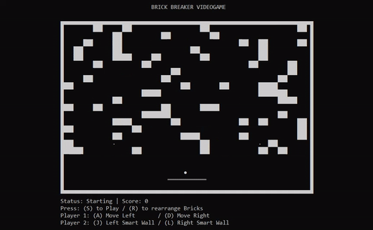

# Brick-breaker-cli

BRICK BREAKER VIDEOGAME

Player's objective is to break all the bricks by maintaining at least one ball above the floor

A - Left (Same key for Move and Stop) 
D - Right (Same key for Move and Stop) 
P - Pause
SPACE - Auto Mode ON
(Pause and unpause game to set Auto Mode OFF)

